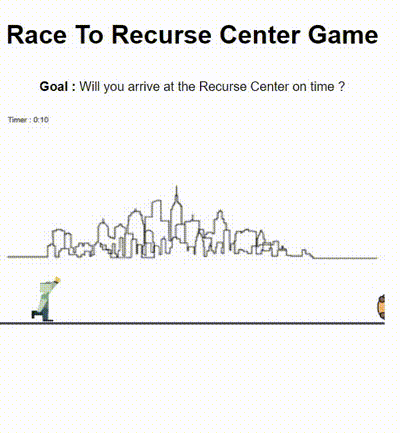

# RaceToRecurseCenter


## Project description

**Race to Recurse Center** is a 2D web game where the player must arrive on time for their first day at Recurse Center. Navigate through the streets of NYC while avoiding obstacles that could slow you down !

## Features

Experience the game directly on the website here: [RaceToRecurseCenter](https://jdasilvalima.github.io/racetorecurse/)

- **Gameplay**: A runner game where the goal is to arrive at the Recurse Center on time.
- **Controls**: Press the spacebar to jump over obstacles.
- **Obstacles**: Random obstacles appear along the path.

## Screenshots


## Project Setup

1. Clone repository
   ```bash
   git clone git@github.com:jdasilvalima/racetorecurse.git
   ```
2. Change directory

   ```bash
   cd racetorecurse
   ```

3. Open the project with a Live Server

## Future Improvements

1. **Mobile Compatibility**: Add support for playing the game on smartphones and tablets to ensure an optimal user experience on mobile devices.
2. **Difficulty Settings Menu**: Implement a menu that allows players to select game difficulty levels (easy, medium, hard) before starting a game.
3. **Screen Size Adaptation**: Ensure the game adjusts automatically to different screen sizes to provide a smooth gaming experience across various resolutions, including mobile, tablet, and desktop screens.

*Icons from [coolhoren](https://www.freepik.com/author/coolhoren/icons) and [iconkh](https://www.freepik.com/author/iconkh/icons)*